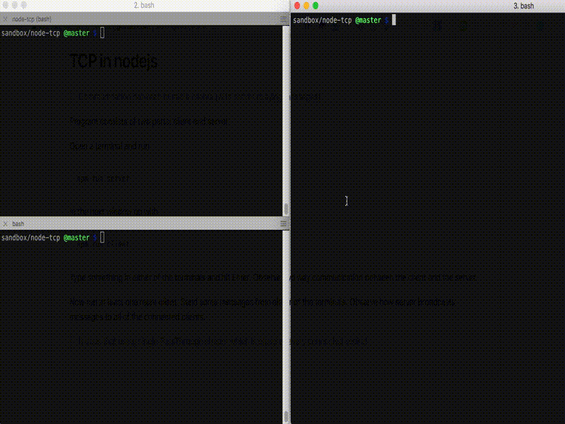

# TCP in nodejs

> Communication between multiple clients (with server relaying messages)



Program consists of two parts: client and server.

Open a terminal and run

```
npm run server
```

In the next window go with

```
npm run client
```

Type something in either of the terminals and hit Enter. Observe two way communication between the client and the server.

Now run at least one more client. Send some messages from either of the terminals. Observe how server broadcasts messages to all of the connected clients.

> It does that using single PassThrough stream which is piped to every connected socket

